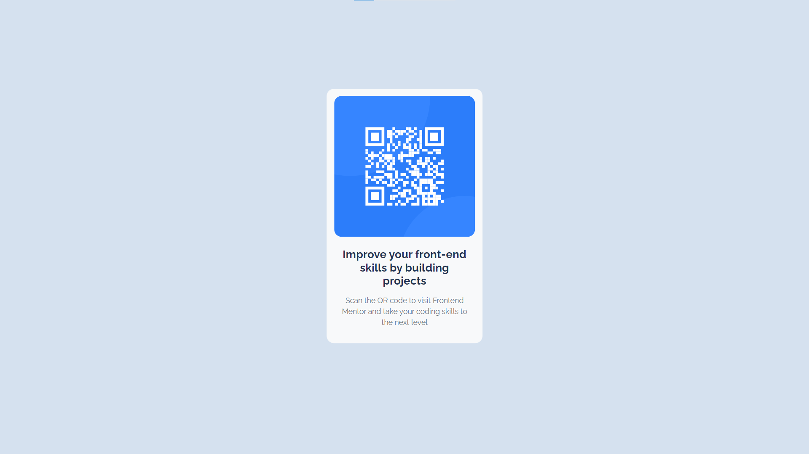

# Frontend Mentor - QR code component solution

This is a solution to the [QR code component challenge on Frontend Mentor](https://www.frontendmentor.io/challenges/qr-code-component-iux_sIO_H). Frontend Mentor challenges help you improve your coding skills by building realistic projects. 

## Table of contents

- [Overview](#overview)
  - [Screenshot](#screenshot)
  - [Links](#links)
- [My process](#my-process)
  - [Built with](#built-with)
  - [Useful resources](#useful-resources)
- [Author](#author)

## Overview

### Screenshot

### Links

- Solution URL: [Add solution URL here](https://github.com/zakaria-imzilen/qr_component_fronendmentor)
- Live Site URL: [Add live site URL here](https://qr-component-frontendmentor-github-io.vercel.app/)

## My process

### Built with

- Semantic HTML5 markup
- CSS custom properties
- Bootstrap to make it responsive
- Flexbox
- CSS Grid
- Mobile-first workflow

## Author

- Website - [Zakaria Imzilen](https://zakaria-imzilen.vercel.app/)
- Frontend Mentor - [@yourusername](https://www.frontendmentor.io/profile/yourusername)
- LinkedIn - [@zakaria-imzilen](https://www.linkedin.com/in/zakaria-imzilen/)
